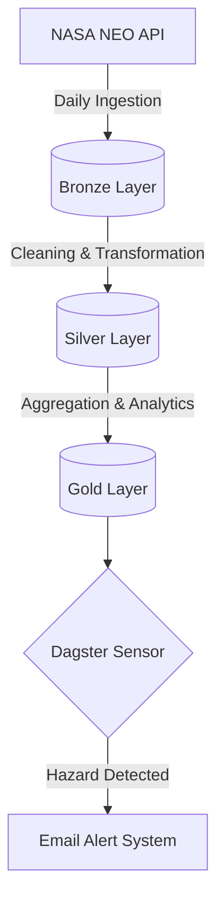

# 🚀 NASA Asteroid Data Pipeline

A robust, orchestrated data pipeline that automatically ingests Near-Earth Object (NEO) data from the NASA API, processes it using a **Medallion Architecture**, and proactively detects hazardous asteroids to send real-time email alerts.

---

## 🏗️ Architecture Overview

The pipeline leverages **Dagster** for orchestration and data asset management, alongside **MySQL** for data warehousing.



## 🛠️ Tech Stack
- **Python**: Core programming language.
- **Dagster**: Data orchestration, asset definition, and scheduling.
- **MySQL**: Data warehouse for all Medallion layers.
- **Pandas / SQL**: Data transformation, cleaning, and metric calculation.
- **NASA API**: Source of daily Near-Earth Object data.

---

## 💿 Data Pipeline Layers (Medallion Architecture)

| Layer | Purpose | Description |
| :--- | :--- | :--- |
| **🥉 Bronze** | Raw Data | Unprocessed data ingested directly from the NASA API (stored in JSON/DB). |
| **🥈 Silver** | Cleaned Data | Normalized schema. Irrelevant fields are removed, and a custom `danger_score` is calculated based on velocity, diameter, and miss distance. |
| **🥇 Gold** | Analytics | Aggregated tables built for reporting (e.g., `gold_daily_asteroid_stats`, `gold_top_dangerous_asteroids`). |

---

## 🚨 Alerting & Sensor Logic

The project includes an automated **Hazard Detection Sensor** running continuously via Dagster.
- **Condition**: Triggers when an asteroid is flagged with `is_hazard = True`.
- **Deduplication**: The sensor utilizes **Dagster Cursors** to store the `last_line` of processed email requests, preventing duplicate alerts from being dispatched to the same user.
- **Action**: Sends a detailed email (via SMTP) to users registered via Google Forms.

---

## 📂 Project Structure

```text
src/
│
├── definitions.py                 # Dagster definitions entry point
├── defs/
│   │
│   ├── data/                      # Local JSON/CSV data storage
│   │   ├── email.json
│   │   ├── nasa_data.json
│   │   └── request_email.json
│   │
│   ├── assets/                    # Dagster Assets (ETL steps)
│   │   ├── bronze.py
│   │   ├── gold_layer.py
│   │   ├── ingest_gg_form.py
│   │   ├── send_email.py
│   │   ├── silver_transform.py
│   │   ├── silver_write_into_db.py
│   │   └── transform_data_gg_form.py
│   │
│   ├── jobs/                      # Dagster Jobs
│   │   └── jobs.py
│   │
│   ├── resources/                 # External Resources (e.g., MySQL connection)
│   │   └── resources.py
│   │
│   ├── schedules/                 # CRON Schedules
│   │   └── schedules.py
│   │
│   ├── sensors/                   # Event-driven Sensors
│   │   └── sensors.py
│   │
│   └── gg_form.txt                # Link to Google Form
│
└── README.md
```

---

## ⚙️ Setup & Installation

**1. Clone the repository**
```bash
git clone <your-repo-url>
cd nasa_clone
```

**2. Environment Variables**
Create a `.env` file in the root directory and configure the following credentials:
```env
# NASA API
API_KEY=your_nasa_api_key

# MySQL Database Connection
MYSQL_HOST=localhost
MYSQL_PORT=3306
MYSQL_USER=your_db_user
MYSQL_PASSWORD=your_db_password
MYSQL_DATABASE=nasa_db

# Email SMTP Settings (For alerting)
EMAIL_USER=your_email@example.com
EMAIL_PASSWORD=your_app_password
EMAIL_HOST=smtp.gmail.com
EMAIL_PORT=587
```

**3. Run Dagster UI**
To start the Dagster development server and view your data assets, run:
```bash
dagster dev -f src/definitions.py
```
Navigate to `http://localhost:3000` to interact with the pipeline.
